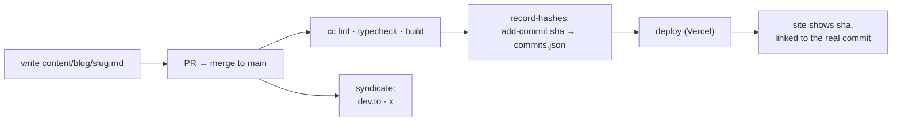

# generalist.dev

> eswar wants to merge a shit-ton of commits into `your-head`

A personal blog cosplaying as a GitHub pull request. Posts are commits. The bio
is a diff. Publishing is a merge to `main` — literally: CI stamps each post
with the sha of the commit that added it, links it back to this repo, deploys
the site, and cross-posts the article to dev.to and X. The footer
is not a joke, it's the architecture: **Reviewed by me. Typed by agents.**

## The conceit, end to end



A post is `draft` (gray, unlinked) until it merges. After that, the hash on the
site is the actual git sha that introduced the file — click it and you land on
the commit in this repo. The blog can't lie about publication status; the git
history *is* the changelog.

## Running it

```bash
npm install
npm run dev        # http://localhost:3000
npm run build      # production build (posts are SSG'd)
npm run lint       # biome
```

## Writing a post

Drop a markdown file in `content/blog/<slug>.md`:

```yaml
---
title: "Go error handling isn't verbose. You're just reading it wrong"
summary: "One line, ≤90 chars. The thesis, not a teaser."
date: "2026-08-09"
tag: "rant(golang)"       # conventional-commit label shown on the card
tagType: "rant"           # feat | rant | perf | chore → timeline dot color
---
```

No `hash:` field — CI owns that. No H1 — the page renders the title. Fenced
code blocks get shiki highlighting, line numbers, and a copy button; ` ```diff `
fences get GitHub-style red/green row tints; every post page has a
**Preview / Code** toggle that shows the raw markdown like a file view.

Images go in `public/images/<slug>/` and are referenced root-relative —
syndication rewrites them to absolute URLs. The markdown renderer adds:

- `` — framed figure card with a mono
  caption bar (the title attribute is the caption)
- consecutive image lines (no blank line between) — a 2/3-column gallery
  with uniform row heights
- `[](url)` — the whole figure links out (use it to
  attribute screenshots to their source)
- **PNG over SVG for diagrams** — SVG renders on-site but dev.to's image
  proxy mangles it in browsers; pre-render mermaid to 2× PNG instead

The full contract (voice included) lives in
[`.claude/skills/write-post/SKILL.md`](.claude/skills/write-post/SKILL.md) —
in Claude Code, `/write-post` drafts a post that follows it.

## CI/CD

Two workflows:

**[`ci.yml`](.github/workflows/ci.yml)** — on every PR and push to `main`:

| job | what |
|---|---|
| `checks` | biome lint, `tsc --noEmit`, `next build` |
| `record-hashes` | for each post not yet in [`content/commits.json`](content/commits.json), find the commit that **added** it (`git log --diff-filter=A`) and append `{slug: sha}`; commits the file back as `github-actions[bot]`. Edits never change a published hash. |
| `deploy` | Vercel CLI, prod deploy of `main` (including the just-recorded hashes) |

**[`syndicate.yml`](.github/workflows/syndicate.yml)** — on pushes to `main`
that add files under `content/blog/`, or manually:

```bash
gh workflow run syndicate -f files="content/blog/<slug>.md"              # both platforms
gh workflow run syndicate -f files="content/blog/<slug>.md" -f platforms=devto
```

- **dev.to** — full markdown, `canonical_url` → this site (SEO stays home).
  Publishing is idempotent by canonical URL: re-runs **update the existing
  article in place** (also how content fixes propagate after a rewrite).
- **X** — published as a real Article (draft → publish): images are uploaded
  via `POST /2/media/upload` and embedded as captioned image entities (first
  one becomes the cover); code fences and GFM tables ride `markdown` entities,
  which X renders natively. X has **no article update API** — re-running
  creates a duplicate, so use `-f platforms=devto` when re-syndicating fixes.

Operational notes, learned the hard way:

- All URLs use `https://www.generalist.dev` — the apex 308-redirects, and
  dev.to's image proxy won't follow redirects. Worse, the proxy **caches
  failures permanently**: if it ever fetches an image before the Vercel deploy
  finishes, that URL is burned and needs a cache-buster (`?v=1`). The script's
  `waitForAssets` polls every referenced image until it's live before posting,
  precisely so this can't happen again.
- One platform failing (or a non-JSON response — looking at you, APIs that
  redirect to HTML) can't take down the others; each runs isolated and the
  rotated X refresh token is persisted even when a platform fails.
- Hashnode was removed: their GraphQL API went Pro-plan-only in May 2026.

### Secrets

| secret | enables | notes |
|---|---|---|
| `VERCEL_TOKEN` `VERCEL_ORG_ID` `VERCEL_PROJECT_ID` | deploy | from Vercel account/`.vercel/project.json` |
| `DEVTO_API_KEY` | dev.to | Settings → Extensions |
| `X_CLIENT_ID` `X_CLIENT_SECRET` `X_REFRESH_TOKEN` | X | console.x.com app (confidential client, pay-per-use credits required). The refresh token is single-use — paste it once, never reuse it elsewhere; CI must be its only consumer |

X token minting: scopes are baked into the token at authorization time, and
the required set is `tweet.read tweet.write users.read offline.access`
**`media.write`** (image uploads). The console's token generator can't request
`media.write` — mint with [`xurl`](https://github.com/xdevplatform/xurl)
(`xurl auth oauth2`, requests every scope by default; needs
`http://localhost:8080/callback` in the app's callback URLs), then copy
`client_id` / `client_secret` / `refresh_token` from **the right app entry**
in `~/.xurl/auth.yml` into the repo secrets — the file can hold several apps
and the id/secret/token must all come from the same one.
| `GH_SECRETS_PAT` | X token rotation | fine-grained PAT, this repo only, **Secrets: read/write**. `GITHUB_TOKEN` can push commits but can never write secrets |

`record-hashes` needs no secret — the built-in `GITHUB_TOKEN` with job-level
`contents: write` covers it.

## Stack

- **Next.js 16** (App Router, Turbopack, SSG for all posts) — note: custom
  build with breaking changes; see `AGENTS.md` and read
  `node_modules/next/dist/docs/` before writing Next-flavored code
- **Tailwind v4** — the design system is CSS tokens in
  [`src/app/globals.css`](src/app/globals.css): GitHub-light palette on paper
  (`#fbfaf7`), IBM Plex Sans/Mono, deliberate light-only
- **shadcn v4 on @base-ui/react** (not Radix) — polymorphism via `render`
  props; components in `src/components/ui/`
- **gray-matter + react-markdown + shiki** (`github-light`) — the markdown
  pipeline, including a custom transformer for grid line numbers and diff row
  tints
- **Biome** for lint/format

## Layout

```
content/
  blog/               posts (markdown, frontmatter contract above)
  commits.json        slug → publishing commit sha, written by CI
src/
  app/                pages: / (PR view), /blog/[slug], /about, /resume
  components/         site components + shadcn ui/
  lib/posts.ts        content loader (fs + gray-matter, build-time)
.github/
  workflows/          ci.yml, syndicate.yml
  scripts/            syndicate.mjs (dev.to / x publisher)
.claude/skills/       write-post skill (the post contract)
claude-design-content/  original design mocks the site was ported from
```

---

© Eswar Saladi · [hello@generalist.dev](mailto:hello@generalist.dev) ·
Reviewed by me. Typed by agents.
