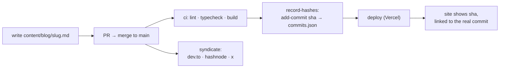

# generalist.dev

> eswar wants to merge a shit-ton of commits into `your-head`

A personal blog cosplaying as a GitHub pull request. Posts are commits. The bio
is a diff. Publishing is a merge to `main` — literally: CI stamps each post
with the sha of the commit that added it, links it back to this repo, deploys
the site, and cross-posts the article to dev.to, Hashnode, and X. The footer
is not a joke, it's the architecture: **Reviewed by me. Typed by agents.**

## The conceit, end to end



A post is `draft` (gray, unlinked) until it merges. After that, the hash on the
site is the actual git sha that introduced the file — click it and you land on
the commit in this repo. The blog can't lie about publication status; the git
history *is* the changelog.

## Running it

```bash
npm install
npm run dev        # http://localhost:3000
npm run build      # production build (posts are SSG'd)
npm run lint       # biome
```

## Writing a post

Drop a markdown file in `content/blog/<slug>.md`:

```yaml
---
title: "Go error handling isn't verbose. You're just reading it wrong"
summary: "One line, ≤90 chars. The thesis, not a teaser."
date: "2026-08-09"
tag: "rant(golang)"       # conventional-commit label shown on the card
tagType: "rant"           # feat | rant | perf | chore → timeline dot color
---
```

No `hash:` field — CI owns that. No H1 — the page renders the title. Fenced
code blocks get shiki highlighting, line numbers, and a copy button; ` ```diff `
fences get GitHub-style red/green row tints; every post page has a
**Preview / Code** toggle that shows the raw markdown like a file view.
Images go in `public/images/<slug>/` and are referenced root-relative —
syndication rewrites them to absolute URLs.

The full contract (voice included) lives in
[`.claude/skills/write-post/SKILL.md`](.claude/skills/write-post/SKILL.md) —
in Claude Code, `/write-post` drafts a post that follows it.

## CI/CD

Two workflows:

**[`ci.yml`](.github/workflows/ci.yml)** — on every PR and push to `main`:

| job | what |
|---|---|
| `checks` | biome lint, `tsc --noEmit`, `next build` |
| `record-hashes` | for each post not yet in [`content/commits.json`](content/commits.json), find the commit that **added** it (`git log --diff-filter=A`) and append `{slug: sha}`; commits the file back as `github-actions[bot]`. Edits never change a published hash. |
| `deploy` | Vercel CLI, prod deploy of `main` (including the just-recorded hashes) |

**[`syndicate.yml`](.github/workflows/syndicate.yml)** — on pushes to `main`
that add files under `content/blog/`:

- **dev.to** — full markdown, `canonical_url` → this site (SEO stays home)
- **Hashnode** — `publishPost` mutation, `originalArticleURL` canonical
- **X** — markdown converted to DraftJS blocks, published via the Articles API
  (draft → publish). OAuth 2.0: a fresh access token is minted per run from the
  refresh token, and because X *rotates* refresh tokens on use, the workflow
  writes the new one back to the repo secret afterwards.

Each platform skips cleanly when its secrets are missing, so they can be
enabled one at a time.

### Secrets

| secret | enables | notes |
|---|---|---|
| `VERCEL_TOKEN` `VERCEL_ORG_ID` `VERCEL_PROJECT_ID` | deploy | from Vercel account/`.vercel/project.json` |
| `DEVTO_API_KEY` | dev.to | Settings → Extensions |
| `HASHNODE_API_KEY` `HASHNODE_PUBLICATION_ID` | Hashnode | PAT + publication dashboard URL |
| `X_CLIENT_ID` `X_CLIENT_SECRET` `X_REFRESH_TOKEN` | X | console.x.com app (confidential client). The refresh token is single-use — paste it once, never reuse it elsewhere |
| `GH_SECRETS_PAT` | X token rotation | fine-grained PAT, this repo only, **Secrets: read/write**. `GITHUB_TOKEN` can push commits but can never write secrets |

`record-hashes` needs no secret — the built-in `GITHUB_TOKEN` with job-level
`contents: write` covers it.

## Stack

- **Next.js 16** (App Router, Turbopack, SSG for all posts) — note: custom
  build with breaking changes; see `AGENTS.md` and read
  `node_modules/next/dist/docs/` before writing Next-flavored code
- **Tailwind v4** — the design system is CSS tokens in
  [`src/app/globals.css`](src/app/globals.css): GitHub-light palette on paper
  (`#fbfaf7`), IBM Plex Sans/Mono, deliberate light-only
- **shadcn v4 on @base-ui/react** (not Radix) — polymorphism via `render`
  props; components in `src/components/ui/`
- **gray-matter + react-markdown + shiki** (`github-light`) — the markdown
  pipeline, including a custom transformer for grid line numbers and diff row
  tints
- **Biome** for lint/format

## Layout

```
content/
  blog/               posts (markdown, frontmatter contract above)
  commits.json        slug → publishing commit sha, written by CI
src/
  app/                pages: / (PR view), /blog/[slug], /about, /resume
  components/         site components + shadcn ui/
  lib/posts.ts        content loader (fs + gray-matter, build-time)
.github/
  workflows/          ci.yml, syndicate.yml
  scripts/            syndicate.mjs (dev.to / hashnode / x publisher)
.claude/skills/       write-post skill (the post contract)
claude-design-content/  original design mocks the site was ported from
```

---

© Eswar Saladi · [hello@generalist.dev](mailto:hello@generalist.dev) ·
Reviewed by me. Typed by agents.
